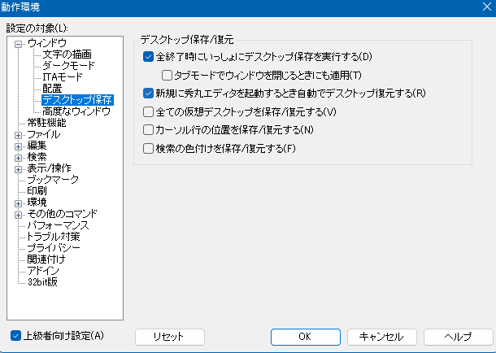

# 「レンダリングペイン」と「秀丸ウィンドウ切り替え」に関する不具合報告

レンダリングペインに表示命令を出した直後に、  
秀丸のアクティブウィンドウが別のウィンドウに切り替わると、  
レンダリングペインのインスタンス作成や描画処理が中断され、  
描画が正常に行われなくなる現象を確認しました。  

特にオーバーレイ表示時に顕著(圧倒的に高確率で再現)ですが、  
オーバーレイでない場合でも描画が中途半端になる可能性が極めて高いです。

## 発生メカニズムの推測

1. マクロからレンダリングペインに命令が送信されます。
2. 秀丸の該当プロセス（該当ウィンドウ）が命令を受け付け、WebView2やウィンドウ重ね処理を開始します。
3. 処理が完了する前に、アクティブウィンドウが別のウィンドウに移動します。

この時、以下の様な結果が生じます。

1. レンダリングペインとして表示されるべきものが全く表示されない。（再現ムービー参照）
2. 中身が空の灰色の領域が中途半端に表示される。（動画にはありませんが、頻繁に発生します）
3. 正しく表示される。
 
上記のように、結果が安定せず、描画状態に一貫性がありません。

## 再現に必要な情報

### 再現ムービー

bug_movie.mp4 (動画では再現されていませんが、灰色の四角形で表示が終わるパターンも存在します。)

### 再現手順における備考

5つ以上のファイルを開いた状態で「デスクトップの保存」を行い、  
秀丸を全て終了後、再度起動すると、「デスクトップの復元」が行われる。  
「次々とアクティブウィンドウを切り替え」ながらファイルが開かれます。  
この動作を利用することで、比較的容易に不具合を再現できます。

## 動作環境の設定

動作環境で「デスクトップの保存と復元」を下図のように設定しています。  

## 具体的な手順とマクロ構成

- #### test.mac と test.html

	レンダリングペインを使用して、エディタ枠の右上に黒い四角と白い文字をオーバーレイ表示するマクロです。  
	HTML側のテキスト表示にディレイ処理を記述していますが、本不具合の発生には影響しません。  

- #### 自動起動マクロの設定
  
	秀丸の「自動起動マクロ」設定で、「ファイルを開いた直後」に test.mac を呼び出すように設定します。

- #### 再現手順

  - 秀丸で5つ以上のファイルを適当に開きます。
  - 「デスクトップの保存」を実行します。
  - 秀丸を全て閉じます。
  - 秀丸を再度起動すると、「デスクトップ復元」機能が働き、  
    次々とアクティブウィンドウを切り替えながら 各プロセスで自動起動マクロ機能により `test.mac` が実行されます。
  - アクティブウィンドウを手動で切り替えるなどすると、  
    - 正しく描画されているウィンドウ
    - 途中で描画が中断されているウィンドウ
    - 何も描画されていないウィンドウ
  
    などが混在した状態になります。

## 補足

この手順を実施することで、高確率で描画が正常に完了しないウィンドウが確認できるはずです。

